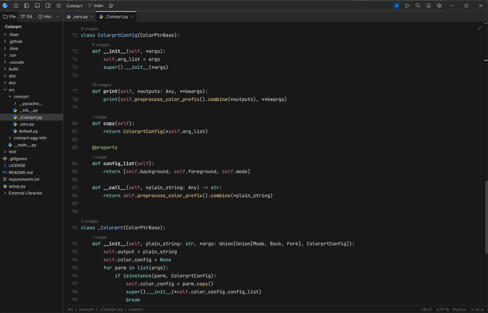
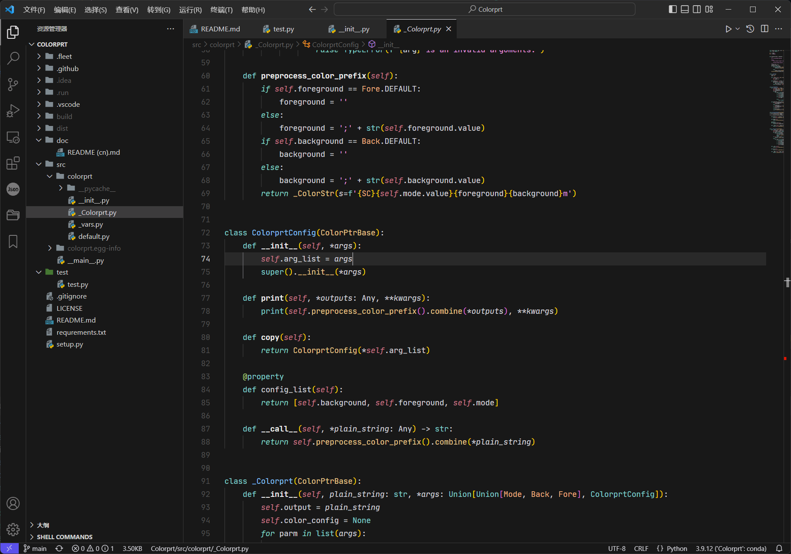
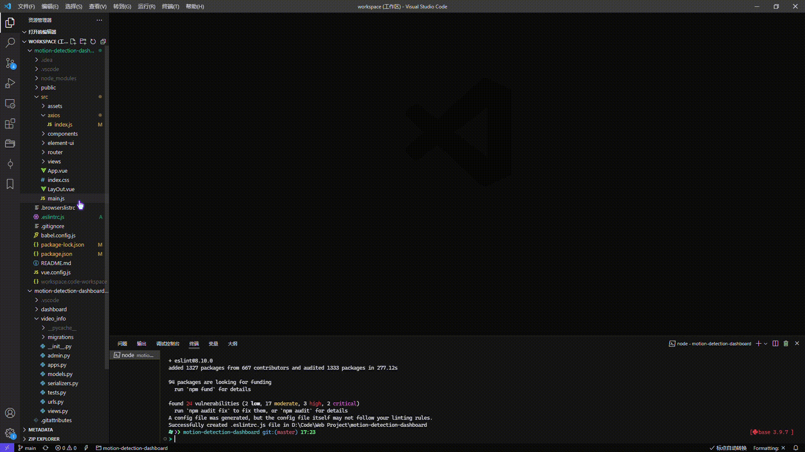
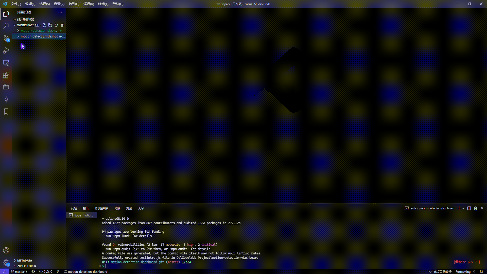

# JetBrain Fleet Theme for Visual Studio Code

<!--  -->


This Theme imitates Jetbrain Fleet as much as possible according to Fleet screenshots.

## Syntax Support

- Python
- Javascript
- TypeScript
- React, Vue
- HTML
- Markdown
- JSON
- CSS, SCSS
- Dockerfile
- Go
- More and more...

## Installation

Install from marketplace <https://marketplace.visualstudio.com/items?itemName=MichaelZhou.fleet-theme>

### Install Jetbrains Mono

- Downloaded and install JetBrains Mono font <https://www.jetbrains.com/lp/mono>

- Add this snippet in your "settings.json":

```js
  "editor.fontFamily": "JetBrains Mono, Consolas, 'Courier New', monospace",
  "editor.fontSize": 14,
  "editor.lineHeight": 1.6,
```

## Screenshots

**The origin screenshot:**



**Vscode with Jetbrain Fleet🚀**



<!-- Screenshot of vue.js



Screenshot of python

 -->

**Enjoy!**

**NOTE** Thanks to anothor theme [Fleetish](https://github.com/krfl/fleetish-vscode). 

If you have any suggestions, create an issue on <https://github.com/Michaelzhouisnotwhite/fleet-theme>
